```mermaid
graph TB
    subgraph "Input Layer"
        A1[Text Files] --> B1[Document Loader]
        A2[PDF Files] --> B1
    end

    subgraph "Processing Layer"
        B1 --> C1[Text Splitter]
        C1 --> D1[Agentic Chunker]
        D1 --> E1[Chunk Manager]
    end

    subgraph "Embedding Layer"
        E1 --> F1[OpenAI Embeddings]
        F1 --> G1[Vector Store]
    end

    subgraph "Storage Layer"
        G1 --> H1[Pinecone Index]
    end

    subgraph "Models"
        I1[Local LLM<br/>Llama3.2] --> D1
        J1[OpenAI Embedding<br/>text-embedding-ada-002] --> F1
    end

    subgraph "Configuration"
        K1[Environment Variables]
        K2[Chunking Config]
        K3[Batch Processing Config]
    end

    style A1 fill:#1a365d,stroke:#60a5fa,stroke-width:2px
    style A2 fill:#1a365d,stroke:#60a5fa,stroke-width:2px
    style H1 fill:#064e3b,stroke:#34d399,stroke-width:2px
    style I1 fill:#78350f,stroke:#fbbf24,stroke-width:2px
    style J1 fill:#78350f,stroke:#fbbf24,stroke-width:2px

    classDef default fill:#1f2937,stroke:#9ca3af,stroke-width:1px;
    classDef config fill:#111827,stroke:#4b5563,stroke-width:1px;
    class K1,K2,K3 config;
```

# System Architecture

This diagram represents the architecture of the Agentic RAG Pipeline system. Here's a breakdown of the components:

## Input Layer

- Handles both text and PDF files
- Uses document loaders to process different file formats

## Processing Layer

- Text Splitter: Breaks documents into manageable chunks
- Agentic Chunker: Intelligently groups related chunks
- Chunk Manager: Manages chunk metadata and relationships

## Embedding Layer

- Uses OpenAI's text-embedding-ada-002 model
- Converts text chunks into vector embeddings
- Prepares vectors for storage

## Storage Layer

- Pinecone vector database for efficient similarity search
- Stores chunk vectors with metadata

## Models

- Local LLM (Llama3.2) for agentic processing
- OpenAI Embedding model for vector generation

## Configuration

- Environment variables for API keys and settings
- Chunking configuration for optimal text splitting
- Batch processing settings for performance tuning

The system implements a sophisticated RAG pipeline with agentic chunking capabilities, allowing for intelligent document processing and retrieval.
