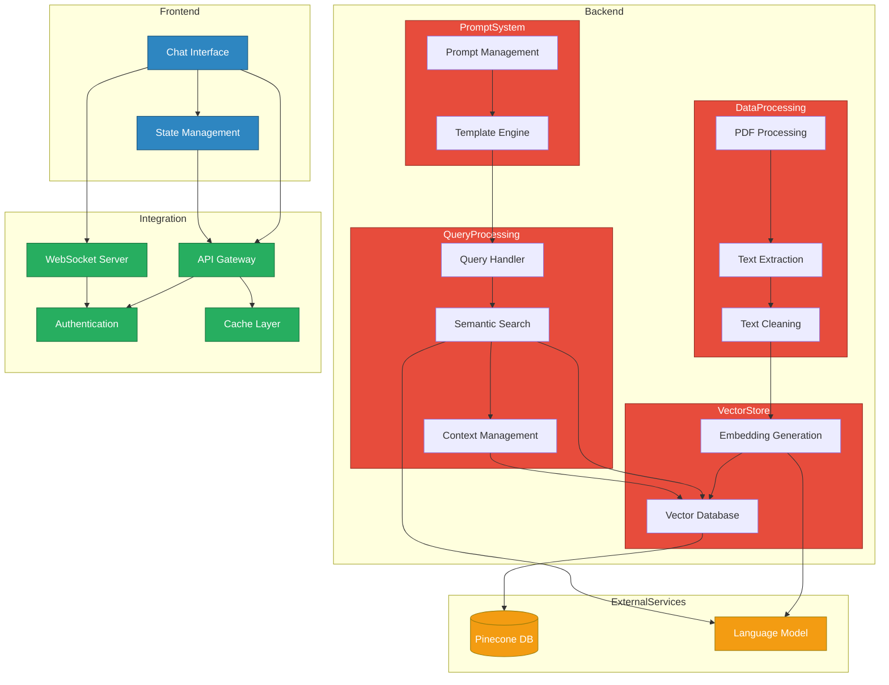

# System Architecture Diagram

## Component Descriptions

### Frontend Components

- **Chat Interface**: User-facing chat UI with real-time interaction
- **State Management**: Handles application state and user session data

### Backend Components

- **Data Processing**

  - PDF Processing: Handles document ingestion
  - Text Extraction: Converts PDFs to text
  - Text Cleaning: Prepares text for embedding

- **Vector Store**

  - Embedding Generation: Converts text to vectors
  - Vector Database: Stores and manages embeddings

- **Query Processing**

  - Query Handler: Processes user queries
  - Semantic Search: Performs vector similarity search
  - Context Management: Maintains conversation context

- **Prompt System**
  - Prompt Management: Handles system prompts
  - Template Engine: Manages response templates

### Integration Layer

- **API Gateway**: Manages all API requests
- **WebSocket Server**: Handles real-time communication
- **Authentication**: Manages security and access
- **Cache Layer**: Optimizes response times

### External Services

- **Pinecone DB**: Vector database service
- **Language Model**: Provides embedding and semantic understanding
